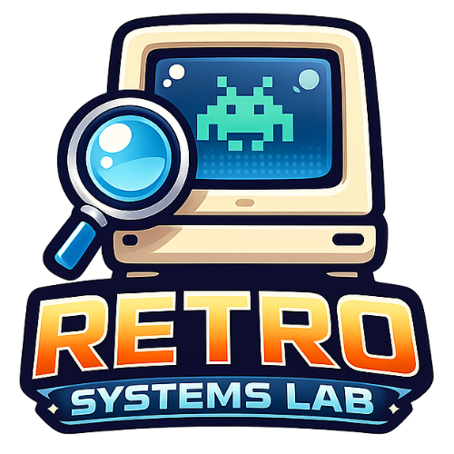

  

# Retro Systems Lab

Retro Systems Lab explores forgotten software platforms, vintage mobile toolchains, preserved SDKs, and the history around them.

## Visit the site

Start here: [retro-systems-lab.github.io](https://retro-systems-lab.github.io/)

This repository is the source for the website, but the best way to experience the project is on the live site.

## What you will find there

- documentation for experiments and working setups
- tools and emulator notes
- archives of older SDKs and related materials
- stories and historical context around retro software ecosystems

## Maintainers

Maintainer-only notes live in `dev-docs/` and are kept out of the published site.
